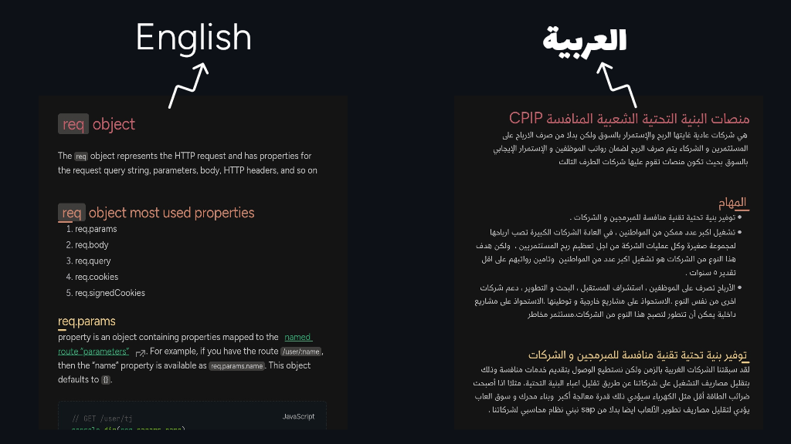
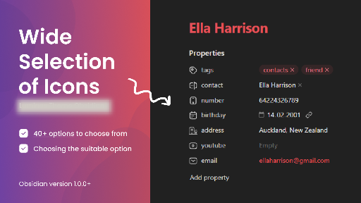
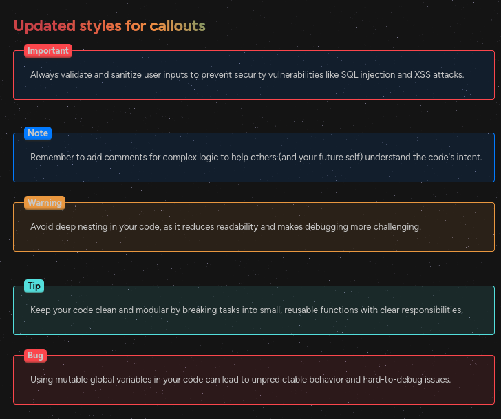
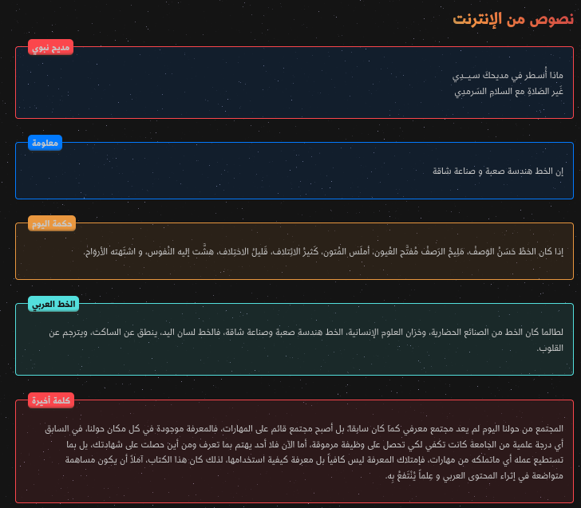
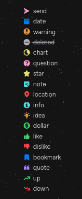

<h1 align="center">Glass Robo</h1>
<h3 align="center">Personal theme for <a href="https://obsidian.md">Obsidian</a> :3</h3> 

  

## Preface

Please do note that I've made this theme for myself, and it may not fit your use cases.

### If you like my theme:

I've made this theme primarily for my own purposes and it's completely free, but if you do like it enough to consider throwing a few coins in my hat, here's a link.  

## Features

7. Stars background.
8. Tow sets of colors for headers.
9. Integration with <a href="https://github.com/mgmeyers/obsidian-style-settings">style settings</a> plugin, which controls some of the features in the theme.
10. One backtick code block dynamic background color.
11. Gradenet color for note title.
12. icons for <a href="https://obsidian.md/plugins?id=cluster">Cluster plugin</a>.

  

   
1. Glassy Design: A modern and sleek interface that enhances your Obsidian experience.

  <ul>
    <li>
     

      
PC Screenshots

        

            <ul>
              
 
              
 
              
 
              
 
            </ul>
        

      

    </li>
  </ul>

  <ul>
    <li>
     

      
Phone Screenshots

        

            <ul>
              
 
              
 
              
 
              
 
              
 
              
 
              
 
            </ul>
        

      

    </li>
  </ul>

   
2. Custom fonts.

    
    
 
    
 Using <a href="https://github.com/mgmeyers/obsidian-style-settings">style settings</a> plugin you can enable/disable custom fonts.

   
3. New icons for meta data properties.

    
    
 
    
 All thanks to <a href="https://github.com/Avesend/obsidian-lumines">lumines theme</a>.

      <ul>
        <li>
          

              
Available icons

              

                  <ul>
                    <li>tags</li>
                    <li>time</li>
                    <li>cssclasses</li>
                    <li>birthday</li>
                    <li>save</li>
                    <li>lovely</li>
                    <li>camera</li>
                    <li>radio</li>
                    <li>music</li>
                    <li>wallet</li>
                    <li>note</li>
                    <li>number</li>
                    <li>city</li>
                    <li>address</li>
                    <li>passport</li>
                    <li>issued</li>
                    <li>game</li>
                    <li>weight</li>
                    <li>ticket</li>
                    <li>bankcard</li>
                    <li>snils</li>
                    <li>socials</li>
                    <li>email</li>
                    <li>source</li>
                    <li>cover</li>
                    <li>author</li>
                    <li>rating</li>
                    <li>year</li>
                    <li>link</li>
                    <li>timer</li>
                    <li>briefcase</li>
                    <li>award</li>
                    <li>book</li>
                    <li>location</li>
                    <li>map</li>
                    <li>bag</li>
                    <li>receipt</li>
                    <li>box</li>
                    <li>reserve</li>
                    <li>key</li>
                    <li>youtube</li>
                  </ul>
              

           

        </li>
     </ul>

   
4. Neat icons for files and folders.

    
    
 

   
5. Updated styles for callouts.

  <ul>
    <li>
     

      
English Screenshot

        

            <ul>
              
 
            </ul>
        

      

    </li>
  </ul>

  <ul>
    <li>
     

      
Arabic Screenshot

        

            <ul>
              
  
            </ul>
        

      

    </li>
  </ul>

   
6. Custom checkboxes.

  <ul>
    <li>
     

      
Screenshot

        

            <ul>
              
 
            </ul>
        

      

    </li>
  </ul>

  <ul>
    <li>
     

      
Available checkboxes

        

            <ul>
                
 - [>] send

                
 - [<] date

                
 - [!] warning

                
 - [-] deleted

                
 - [/] chart

                
 - [?] question

                
 - [*] star

                
 - [n] note

                
 - [l] location

                
 - [i] info

                
 - [I] idea

                
 - [S] dollar

                
 - [p] like

                
 - [c] dislike

                
 - [b] bookmark

                
 - ["] quote

                
 - [u] up

                
 - [d] down

            </ul>
        

      

    </li>
  </ul>

